# DEV-01, Create Head Base
### Link:[<>]
#### Tags: []

## Set up Area

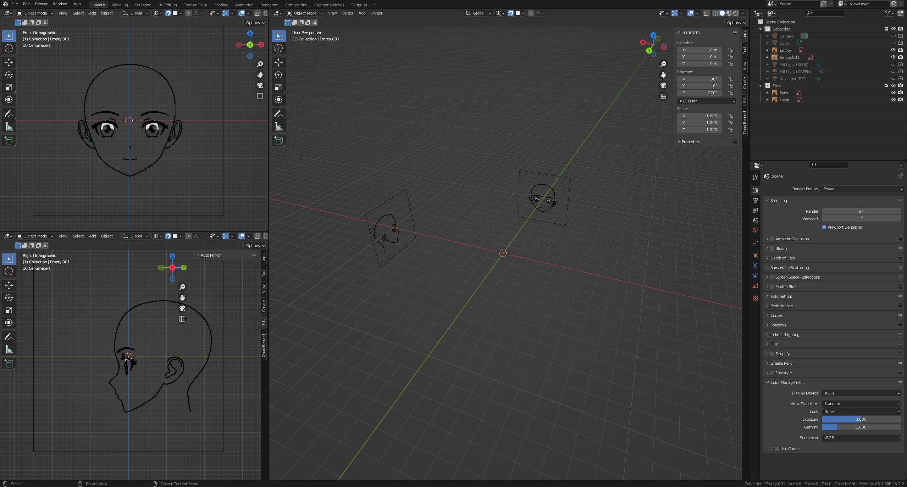

## Creating Vertices
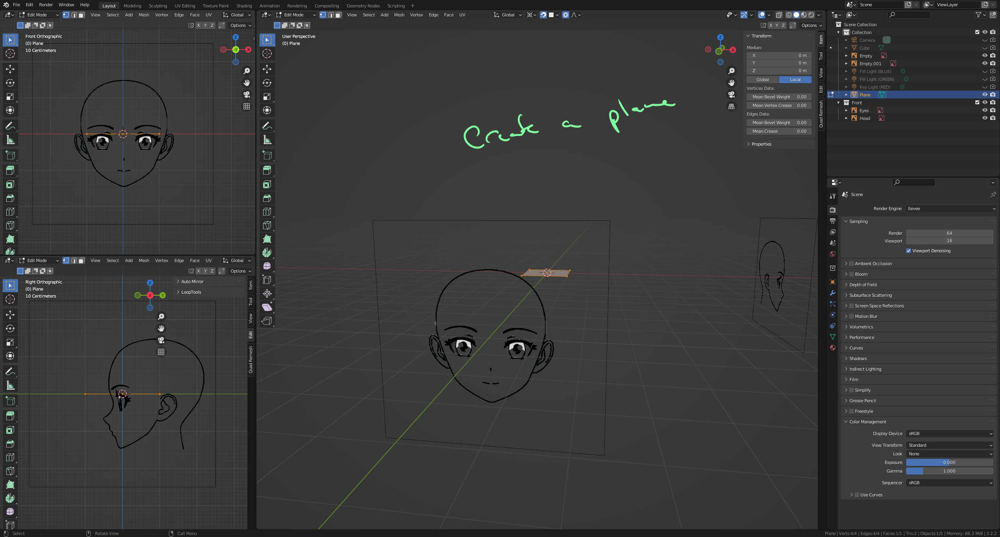

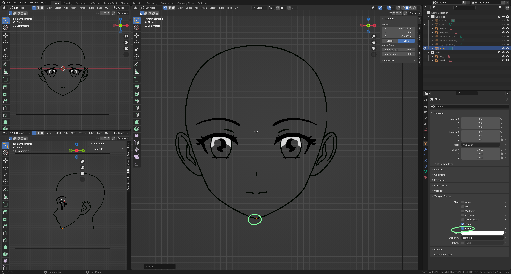

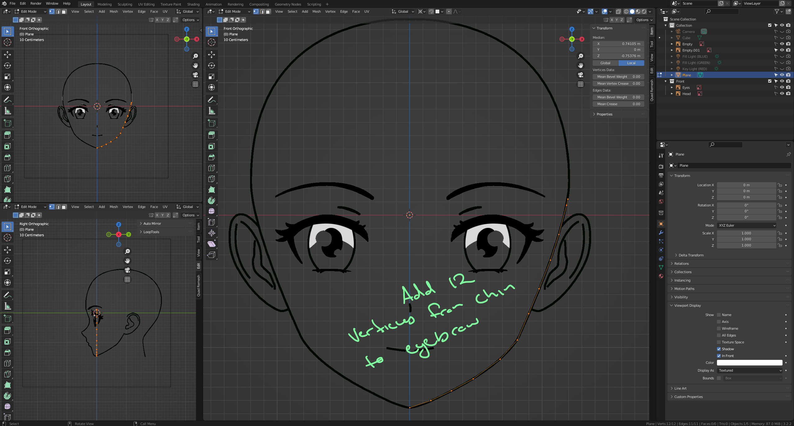

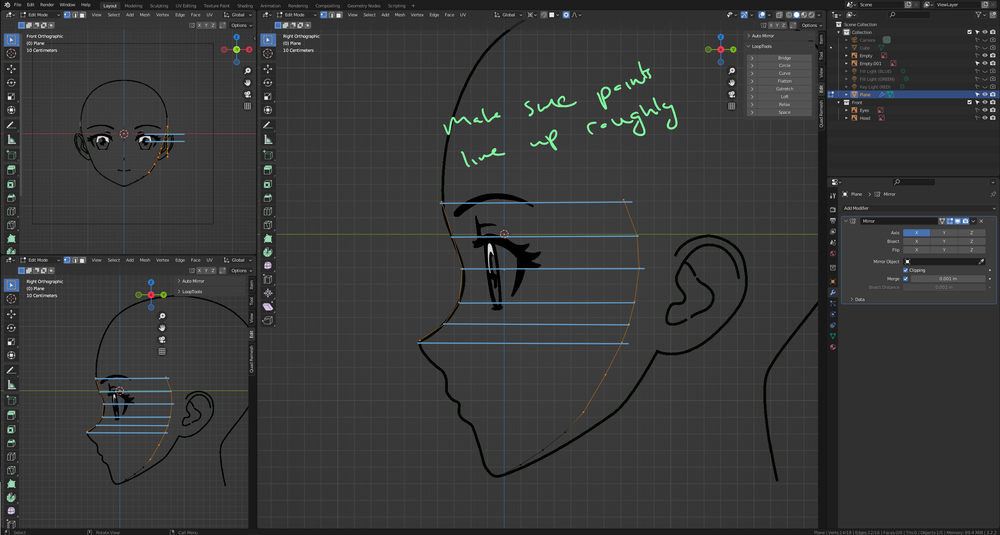

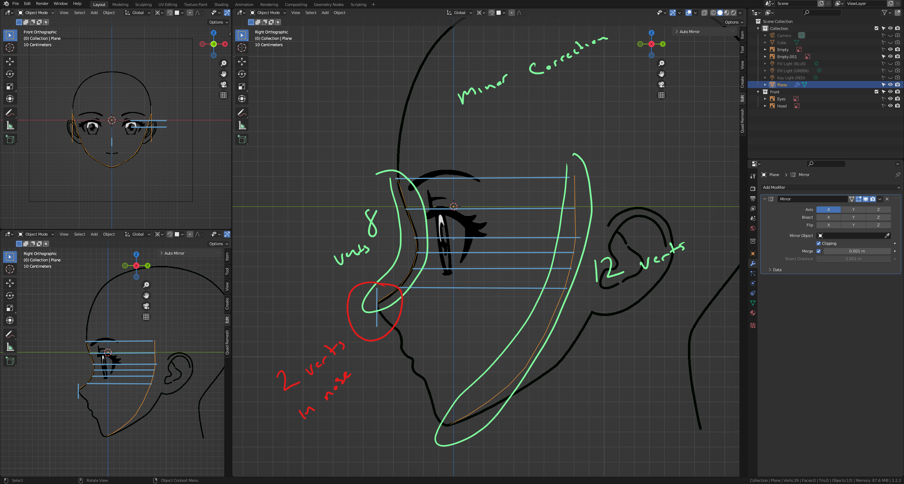

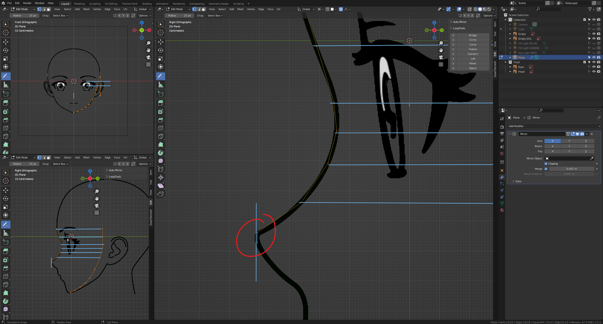

## Adding Faces Part 2

<!-- 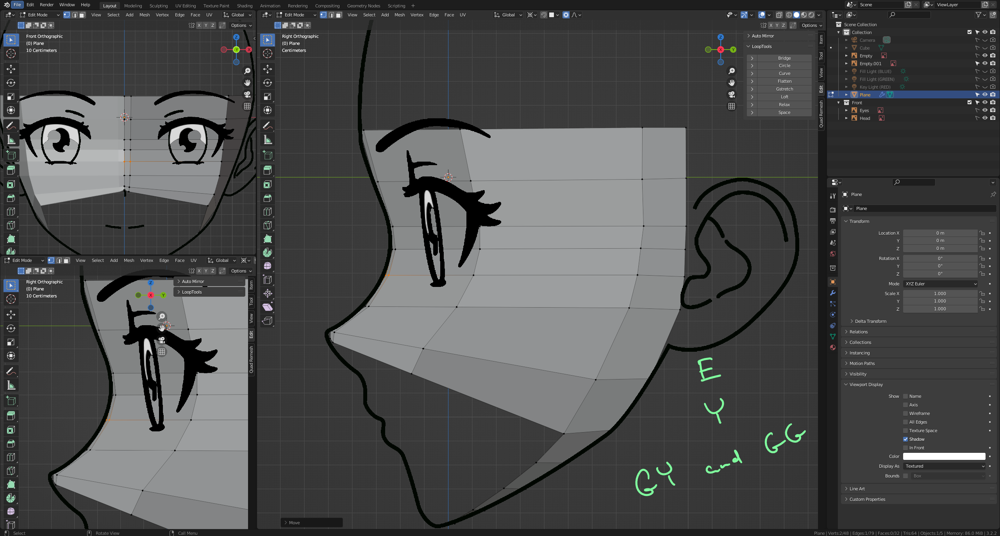 -->

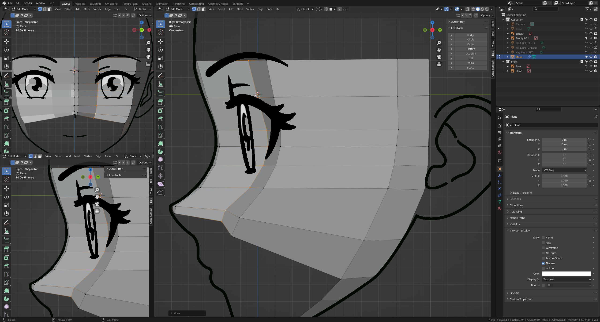

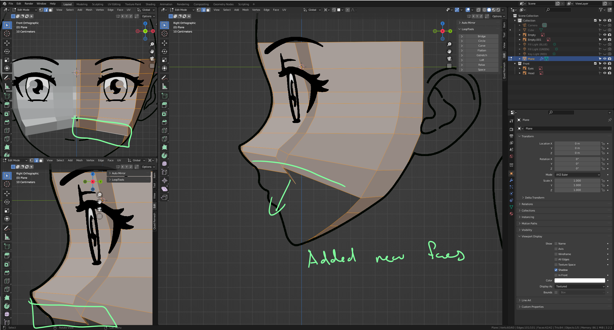

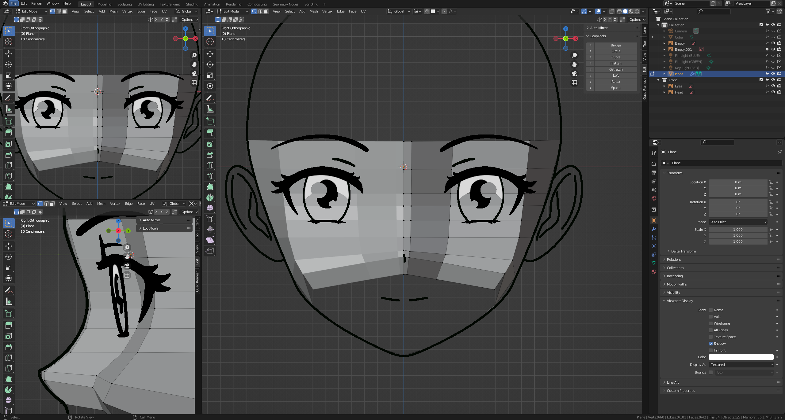

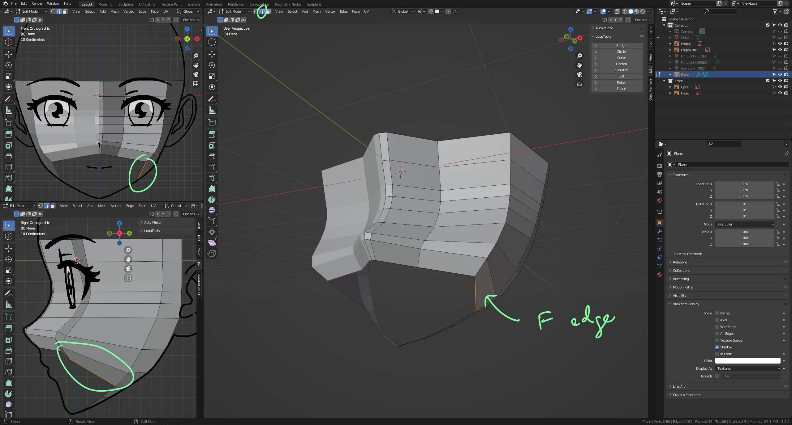

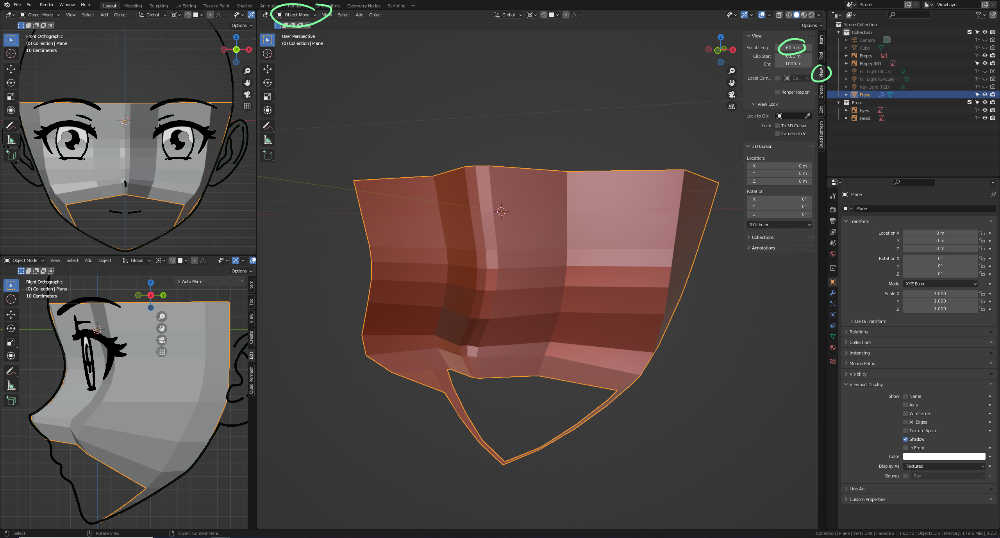

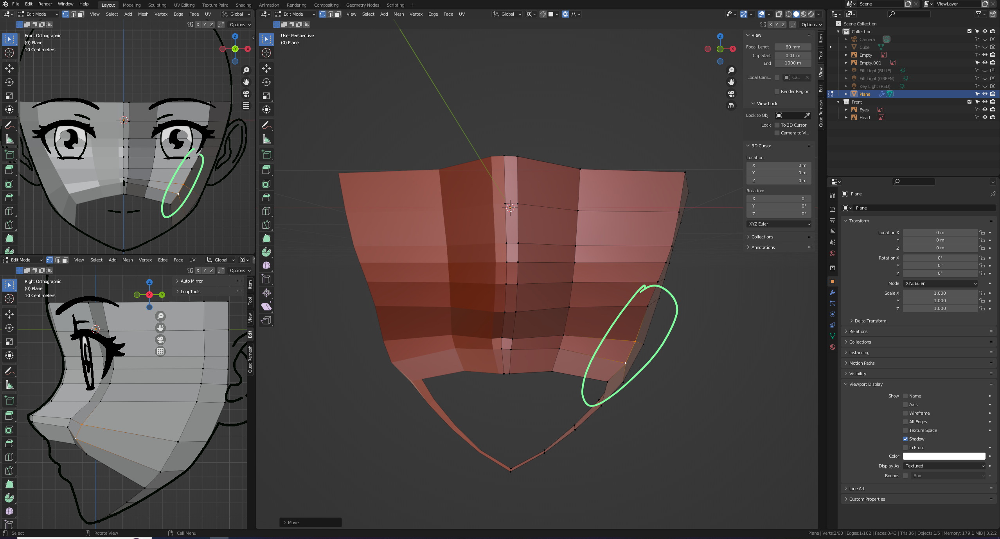

## Adding Face Part 2

    Why do we shade smooth? We do so because we are going to fix single vertices and 
    we need to see a semblance of the end result to do so.

## The Nose and Chin

## Mouth

## Lower head and neck

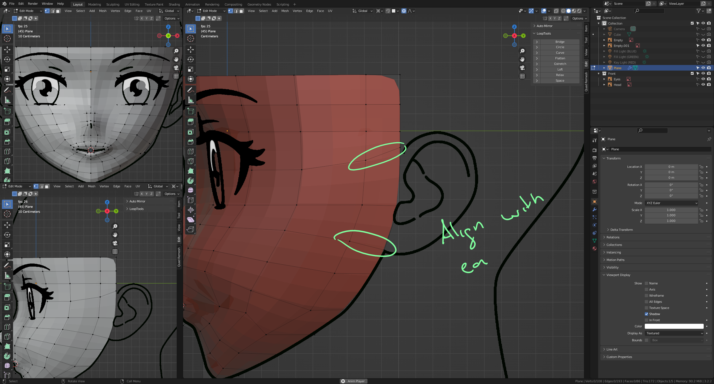

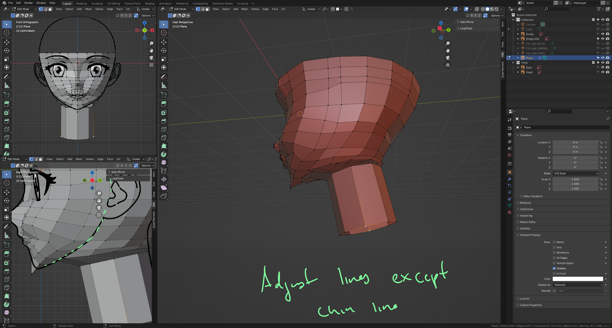

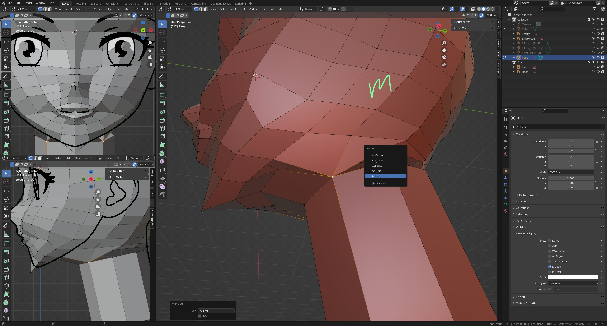

## Upper head

